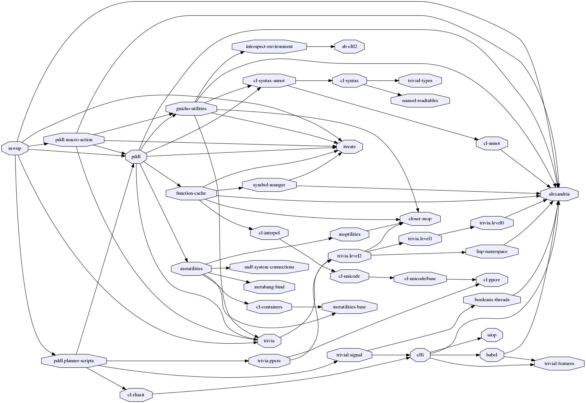

# Mwup - Macro without Utility Problem

[](https://circleci.com/gh/guicho271828/mwup/tree/master)

## Usage

```
Usage: mwup PROBLEM [DOMAIN] [MACROPLANS...]
    -----------------debug-options---------- : -------------------------------
    -v                                       : Become more verbose
    --seed                             SEED  : Random seed, either an unsigned integer or 
                                               a symbol t, which means a fresh random value.
    --megabytes-consed-between-gcsMEGABYTES  : Gc tuning
    --validation                             : Run the validator after the planning
    --enhance-only                           : When non-nil, enhance the domain with macros but do not solve the problem
    --------------macro-options----------    : -------------------------------
    --plain                                  : Do not add the macros.
    --mangle                                 : Action names are mangled.
    --junk                  LENGTH QUANTITY  : A list of 2 integers. 1st element is the length of the junk macros.
                                               2nd element specifies the number of junk macro.
                                               if *junk* is nil, no junk macros should be added.
    --fastjunk              LENGTH QUANTITY  : Same as --junk and --junk-type :greedy
    --junk-type                        TYPE  : Specify the type of junk generation. one
                                               of :reservoir, :greedy, :relative-greedy. :greedy is equivalent to
                                               --fastjunk. :relative-greedy treats quantity argument as a percentage,
                                               and compute the actual quantity relative to the number of
                                               primitive actions.
    --force-lifted                           : Lift the macro actions.
    ----------computational-resource-------- : -------------------------------
    -t                                  SEC  : Time limit for the main search. not the total limit
    -m                         MEMORY-IN-KB  : Memory limit for main search and subproblems. not the total limit
    --------underlying-planner-options------ : -------------------------------
    --search           PLANNER OPTIONS... -  : Specify mainplanner. options end with a "-".
                                             : Where planner is one of: fd-clean,ff-clean,probe-clean,
                                             : Marvin1-clean,marvin2-clean,lpg-clean,mp-clean.
    -------planner-compatibility-options---- : -------------------------------
    --add-macro-cost                         : Unit-cost domains are converted into action-cost domains.
                                               in those domains macro actions are then given a cost same as
                                               its length.
    --remove-cost                            : Remove :action-costs from the resulting domain.
    -------------shortcuts/aliases---------- : -------------------------------

DOMAIN is by default domain.pddl, or <problemname>-domain.pddl in the same directory
MACROPLANS are by default <problemname>.macro.?[0-9]* in the same directory
```

## Dependencies
This library is at least tested on implementation listed below:

+ SBCL 1.3.0 on X86-64 Linux 3.19.0-39-generic (author's environment)

Also, it depends on the following libraries:

+ pddl.planner-scripts :
    
+ pddl.macro-action by *guicho* :
    
+ pddl by *guicho* :
    PDDL parser
+ alexandria by ** :
    Alexandria is a collection of portable public domain utilities.
+ iterate by ** :
    Jonathan Amsterdam's iterator/gatherer/accumulator facility



## Installation

## Author

* Masataro Asai (guicho2.71828@gmail.com)

## Copyright

Copyright (c) 2015 Masataro Asai (guicho2.71828@gmail.com)

# License

Licensed under the WTFPL License.


